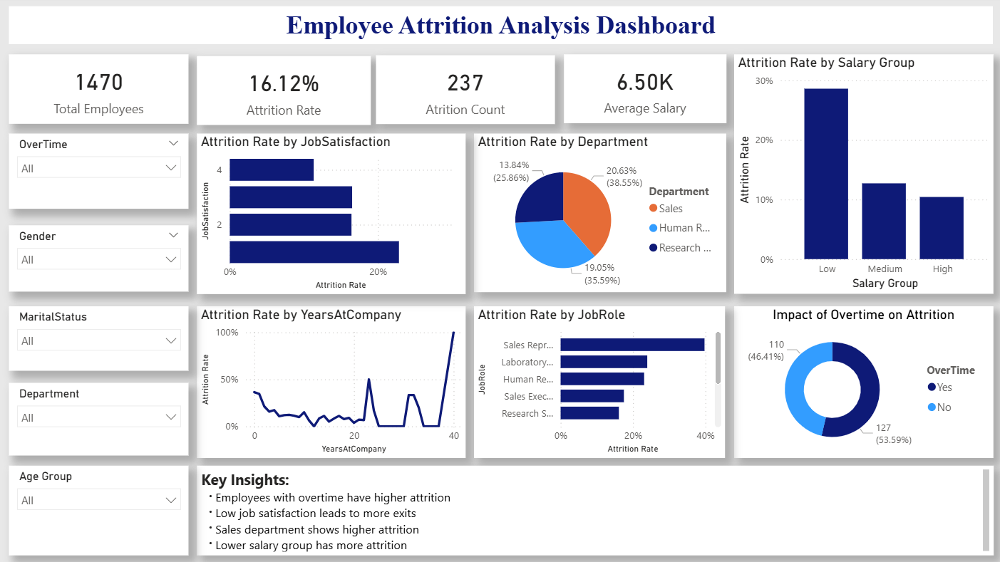

## Employee Attrition Analysis Dashboard

## Project Overview
This project focuses on building an interactive dashboard using Microsoft Power BI to analyze employee attrition and identify key factors influencing why employees leave an organization. The dashboard provides meaningful insights through visualizations and interactive filters.

---

## Dataset
- HR Employee Attrition Dataset

---

## Objective
To create an interactive report that answers:
Why are employees leaving?

The dashboard enables users to explore attrition trends based on:
- Department
- Job Role
- Salary Group
- Job Satisfaction
- Overtime
- Age Group

---

##  Tools & Technologies
- Microsoft Power BI
- Data Cleaning & Transformation
- Data Visualization

---

## Dashboard Features

### KPI Cards
- Total Employees
- Attrition Rate
- Attrition Count
- Average Salary

### Visualizations
- Attrition Rate by Department
- Attrition by Job Role
- Attrition by Salary Group
- Attrition by Job Satisfaction
- Attrition by Years at Company
- Impact of Overtime on Attrition

### Interactive Filters
- Gender
- Department
- Age Group
- Marital Status

---

## Key Insights
- Employees working overtime have higher attrition
- Low job satisfaction leads to more employee exits
- Sales department shows higher attrition
- Lower salary group has more attrition

---

## Dashboard Preview

---

## Dashboard Demo Video
[Dashboard Video](Employee_Attrition_Analysis_Dashboard.mp4)

---

## Conclusion
This dashboard helps identify major factors contributing to employee attrition and supports data-driven decision-making to improve employee retention.

---
